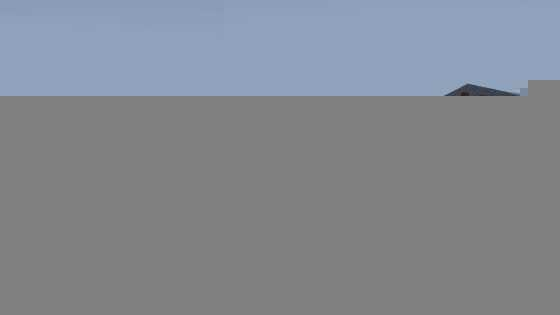

# Gear Sandbox

브라우저에서 도는 기어·동력전달 시뮬레이터입니다. 인볼류트(involute) 치형 수학으로 기어가
실제로 맞물려 돌고, 그 위에 토크·관성·질량·중력을 푸는 물리 엔진이 얹혀 있습니다. 12종의
동력전달 오브젝트로 직접 기계를 만들 수도 있고, 완성된 예제 기계 23대를 불러와 동작을 볼
수도 있습니다.



```bash
npm install
npm run dev     # 클라이언트(Vite, 5173) + API 서버(3001)를 함께 띄웁니다
```

열면 위 화면이 바로 나옵니다. 왼쪽 팔레트 아래 **예제 모형** 목록에서 기계 하나를 고르면
그 기계만 단독으로 볼 수 있습니다.

---

## 무엇을 모델링하는가

이 구분이 이 프로젝트에서 가장 중요합니다. **모델링하지 않는 것을 주장하지 않는 것**이
코드 주석부터 테스트까지 전체를 관통하는 규칙입니다.

### 모델링하는 것

| 영역 | 내용 |
|---|---|
| **맞물림·회전** | 실제 인볼류트 치형 곡선(압력각·기초원·이끝원/이뿌리원). 기어비와 회전 방향은 정확합니다 |
| **토크와 관성** | `J_eff·dω/dt = T_eff`. 반사 관성 `ΣJᵢnᵢ²`, 반사 토크 `Σnᵢ·Tᵢ` |
| **질량** | 각 부품이 **실제로 그려지는** 강철 부피에서 유도합니다. 자유 파라미터가 아닙니다 |
| **모터** | 토크-속도 직선. 기계가 가속하고, 부하에 처지고, 회복합니다 |
| **마찰** | 베어링·부하의 점성 감쇠, 차량 무게에 비례하는 구름저항, 낙하 부품의 접촉 마찰 |
| **중력** | 9.80665 m/s², 자유낙하·반발·접촉. 지구/달/화성/목성/무중력 선택 |
| **주행** | 무활주 구름: `거리 = 바퀴회전 × 반지름`. 자동차와 증기기관차가 실제로 달립니다 |

**단위는 `src/sim/units.ts` 에 고정돼 있습니다 — 1 월드 단위 = 1 센티미터.** 모든 물리 식은
SI 로 계산하고 그 경계에서 변환합니다. 월드 단위를 미터처럼 쓰면 반올림 오차가 아니라
버그입니다.

### 모델링하지 않는 것 — 주장 금지

- **무게가 기어열을 당기지 않습니다.** `load` 기어는 **점성 댐퍼**이지 매달린 질량이
  아닙니다. 호이스트는 제가 든 것을 느끼지 못하고, 크레인 지브는 처지지 않습니다. 중력이
  기어열에 닿는 경로는 차량의 구름저항 단 하나뿐입니다.
- **견인력 한계가 없습니다.** 바퀴는 토크를 아무리 줘도 미끄러지지 않습니다.
- **기계 부품끼리 접촉하지 않습니다.** 기어는 충돌하지 않고, 떨어진 부품은 기계를 통과해
  내려가며, `isOverlapping` 은 **진단**이지 물리가 아닙니다.
- **과부하 파손이 없습니다.** 내구도는 시간과 속도로 닳는 **게임 장치**이지 재료 모델이
  아닙니다.
- **증기·연소·열·유체가 없습니다.** 모터의 직선 하나가 그 전부를 대신합니다.
- **백래시·컴플라이언스·맞물림 효율 손실이 없습니다.** 기어열은 완전 강체이고 비는 정확합니다.

그래서 "이 감속기가 N을 들어올린다"는 말은 할 수 없습니다. 반면 "이 기계는 0.4초에 정속에
도달한다", "이 감속은 입력축에서 피동기어를 16분의 1 무게로 느끼게 한다" 는 실제 출력이고
테스트가 수치로 검증합니다.

---

## 기능

- **12종 오브젝트** — 평기어·헬리컬·손잡이(동력원)·베벨·웜·부하(플라이휠)·랙·유성기어 세트·
  래칫·스프로킷(체인)·풀리(벨트)·차동장치. 전부 실제 기계에서 하나 이상이 쓰입니다.
- **예제 기계 23대** — 시계 · 자동차 · 성문 · 기중기 · 비행기 · 풍차 · 자전거 · 증기기관차 ·
  피스톤엔진 · 공장 라인샤프트 · 물레방아 · 관람차 · 회전목마 · 두레박 우물 · 컨베이어 ·
  타워크레인 · 오르골 · 시계탑 · 변속기 · 유성감속기 · 차동축 · 웜 테이블 · 캡스턴.
  20대는 기본 쇼룸에 5×4 로 놓이고, 오르골과 시계 무브먼트는 탁상 크기라 목록에서만 부릅니다.
- **클릭 배치·드래그 이동** — 겹치는 자리를 클릭하면 비켜 놓이되, 같은 축에 포개는 커플링
  배치는 의도로 보고 허용합니다.
- **체인/벨트 원격 연결** — 떨어진 스프로킷·풀리 사이로 동력을 넘깁니다.
- **부품 떨어뜨리기** — 실제 자유낙하·반발·구름. 중력을 바꾸면 낙하 시간이 `√(2h/g)` 대로
  달라집니다.
- **절차적 사운드** — 오디오 파일 없이 합성합니다. 가장 빠른 기어를 따라가는 윙윙거림, 그
  위의 톱니 소리, 충돌 속도에서 세기를 얻는 착지음.
- **내구도·진단·저장** — 마모와 파손, 미연결/동력없음/겹침 자동 감지, 로컬 저장소·JSON
  파일·서버(SQLite) 세 경로.

---

## 조작

| 동작 | 방법 |
|---|---|
| 오브젝트 배치 | 왼쪽 팔레트에서 종류 선택 → 뷰포트 클릭 |
| 배치 취소 | `Esc` |
| 선택 / 이동 | 클릭 / 선택 후 드래그 |
| 축 변경 | 선택 후 패널의 X/Y/Z 버튼 |
| 삭제 | 패널의 "삭제", 또는 `Delete`/`Backspace` |
| 체인·벨트 연결 | 연결 모드 → 같은 종류 둘을 순서대로 클릭 |
| 전체 보기 | "전체 보기" 버튼 (카메라 리셋) |

---

## 아키텍처

```
src/sim/            렌더링·DOM 의존이 없는 순수 시뮬레이션
  units.ts            1 단위 = 1 cm. 모든 물리 식이 SI 로 변환하는 경계
  meshing.ts          맞물림 판정의 최종 권위
  rotation.ts         연결 성분마다 자유도 1로 회전 전파
  dynamics.ts         토크·관성·모터 곡선, 반사 규칙
  gravity.ts          낙하 부품의 자유낙하·접촉·반발·마찰
  simulation.ts       매 틱: 동역학 먼저, 그다음 기하
  ground.ts           기계를 지면에 앉힘(파묻힌 것은 올리고 뜬 것은 내림)
  presets/            예제 기계 한 대당 한 모듈 (23 + index + wheels 헬퍼)
  showroom.ts         기본 쇼룸 5×4 배치
src/render/         Three.js 지오메트리·재질·씬 동기화
  sceneSync.ts        매 프레임 시뮬레이션 상태를 메시에 반영. 프롭 이동 5기구도 여기
  props.ts            프리셋이 적은 숫자가 기하가 되는 지점
src/interaction/    포인터 입력(클릭 배치, 드래그)
src/ui/             DOM 사이드바 패널들
src/persistence/    직렬화/역직렬화 (로컬·파일·서버)
server/             Express + better-sqlite3, /api/layouts
tests/              src/ 를 그대로 반영 + tests/meta/ 의 스위트 자체에 대한 가드
```

### 프롭을 움직이는 다섯 기구

프리셋의 장식 부품은 정적이 아닙니다. `sceneSync` 가 매 프레임 다시 포즈시킵니다.

| 기구 | 하는 일 | 사용 |
|---|---|---|
| `attachTo` | 기어의 **중심**을 축으로 함께 돈다 | 140개 |
| `windWith` | 드럼에 감기는 로프를 탄다 — `clamp(회전 × 반지름, lo, hi)` | 18개 |
| `linkTo` | 크랭크-슬라이더 부재로 움직인다 | 11개 |
| `ridesOn` | 차량 주행거리만큼 이동한다 | 8개 |
| `slideWith` | 랙의 선형 이동을 따라 미끄러진다 | 7개 |

순서와 합성 규칙이 중요합니다. `windWith` 는 `attachTo` 의 회전 포즈에 **더해지고**(타워크레인
후크가 지브와 함께 돌면서 로프로도 올라감), `ridesOn` 은 **마지막에** 돌아 바퀴살이 돌면서
동시에 주행합니다.

---

## 테스트

```bash
npm test                        # 전체 (989개 / 77개 파일)
npx tsc --noEmit                # 타입 검사 — vitest 는 타입을 보지 않습니다
npx vite build                  # 빌드
npx vitest run tests/sim        # 시뮬레이션 코어만
```

**세 가지로 모두 검증해야 합니다.** vitest 는 타입 검사를 하지 않으므로 `tsc` 가 vitest 가
놓치는 실제 버그를 잡습니다.

### 스위트 자체에 대한 가드 (`tests/meta/`)

이 저장소에서 가장 흔했던 결함은 **틀린 단언이 아니라 실패할 수 없는 단언**이었습니다. 약 30건이
발견돼 제거됐고, 가장 흔한 꼴은 기계적으로 차단됩니다.

- `vacuousAssertions.test.ts` — 프리셋 상수와 그 정의의 모든 피연산자가 한 줄에 함께 나오는
  등식 단언을 실패시킵니다. `expect(TIP_R).toBe(R + MODULE)` 같은 것.
- `everyPresetSitsOnTheGround.test.ts` — 앉힌 뒤 모든 프리셋의 최저점이 0인지, 두 번 앉혀도
  좌표가 그대로인지.

### 테스트를 쓸 때

**양변이 같은 출처면 그 단언은 아무것도 검사하지 않습니다.** 진짜 단언은 경계를 넘습니다 —
상수를 **측정된 기하**와, 유도식을 **실제로 돌린 시뮬레이션**과, 프리셋을 **실제로 내놓은
프롭**과 비교하세요.

그리고 **실패할 수 있음을 증명하세요.** 테스트가 덮는다고 주장하기 전에 그 대상을 일부러
망가뜨려 빨간불을 확인하십시오. 초록이면 그 테스트는 제 이름이 말하는 것을 덮고 있지 않습니다.
사례와 자세한 규칙은 [AGENTS.md](AGENTS.md) 에 있습니다.

---

## 환경 변수

- `API_PORT` — API 서버 포트 (기본 3001)
- `DB_PATH` — SQLite 파일 경로 (기본 `server/data/layouts.db`)

---

## 기여 / 에이전트 작업

코드를 고치기 전에 [AGENTS.md](AGENTS.md) 를 읽으세요. 불변식, 함정, 검증 방법, 그리고
"검증한 것만 주장한다" 규칙이 정리돼 있습니다. 현재 상태와 남은 일은
[docs/STATUS.md](docs/STATUS.md) 에 있습니다.

사용자 노출 문구·기어 id·프리셋 라벨은 **한국어**, 코드 주석과 식별자는 **영어**입니다.

## 라이선스

MIT. 전문은 [LICENSE](LICENSE) 를 보세요.
